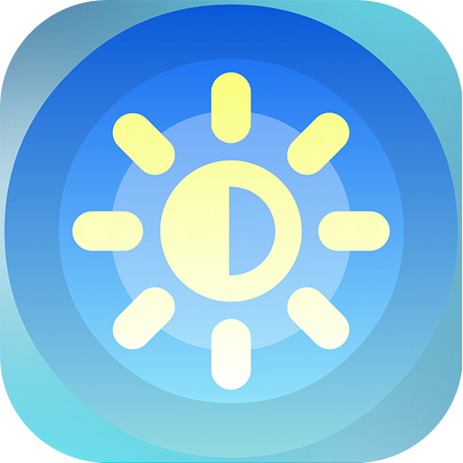
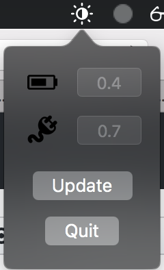

# Brght

Hello, this is a macOS toolbar application for automating display brightness based on if the computer is plugged in or not.

## Getting Started

You can either build the project yourself or download the app under [releases](https://github.com/Calhuang/Brght/releases).

The battery icon is the brightness at which you want the screen to be when not plugged in.  

The cord icon is the brightness at which you want the screen to be when plugged in.

Make sure to disable "auto-brightness" and "dim screen when on battery power" as those conflict with the program.

Use decimal values from 0.0 - 1.0

## Built With

* Xcode version 9.3
* Swift 4.1

## License

This project is licensed under the Apache License - see the [LICENSE.md](LICENSE.md) file for details

## Acknowledgments

* Thanks to PurpleBooth for the markdown template!

## Donations

Thank you for your support!

Bitcoin: 19oimzaeMPZcQ18FvVgoUu5fcHBWrnrKRH
